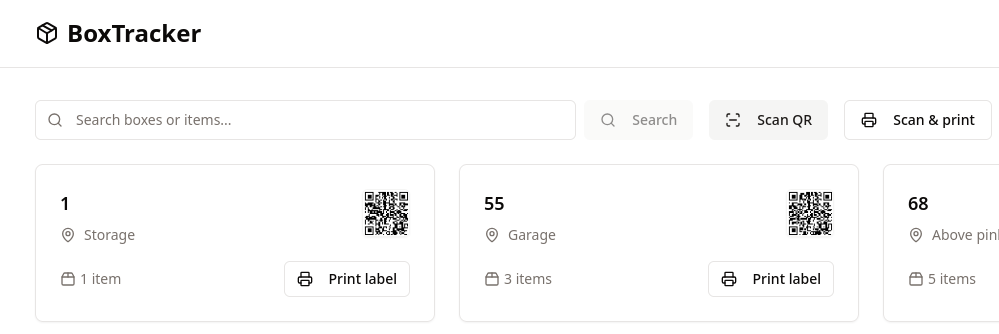

# boxTracker

Welcome to boxtracker a lightweight app for organising your garage, shed or other storage locations.

Using any browser on any device, you can access a secured storage database that is available to you for managing the minutia of life so that you can forget them.

# Why box tracker?

I have 150 Really Useful Storage boxes, and my definition of tidying up, or being organised is to shove it in a plastic storage box.

While ago, I lost something, and so I opened every single box, and poured through everything I had stored...I bet you cannot guess which box I found my item in....?

So I said never again, there has to be a better way.  So I built boxtracker.

The concept is as simple as I could make it:

1.Boxes
2.Items

That is it!  We have storage boxes and into those boxes we place items.  Never wanting to waste another 2 hours searching through every storage box I had, only to find the item in the first box, but I missed it (did you guess?)!

I placed numbers on the side and top of each Really Useful Storage box I owned (by the way Really Useful Storage are the best).

I opened a random box and I grabbed my phone, and said here goes, and I started to create my storage items database.  You can do that as well, just register and away you go.

Features
Boxes
* Each box name must be unique and using numbers is perfect
* Each box also has a description, location, comments
* You can search for your boxes and you can edit the name
* Each box has a QR Code assigned to pull up later on a mobile device

Items
* Each box contains items, after first creating the box
* Each item has a name and a description
* Add, Edit, Delete or Move individual items
* Search for any item

Keep the item names punchy, but use the description for more details, or comments.

